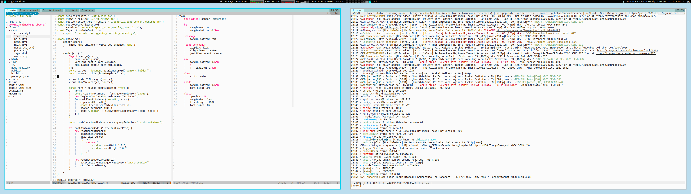

dotfiles
--------

This repository contains configuration files and scripts tailored to my needs
or preferences. Some of these might prove useful to other people. The most
custom goodies are located in the `bin/` directory.

[](https://raw.githubusercontent.com/rr-/dotfiles/master/screen.png)
*What it roughly looks like when I'm not using a web browser*

#### Repository structure

- `bin/`: custom tools
- `cfg/`: configuration and installers for third party programs
- `lib/`: code shared between the scripts in `bin/` and the modules in `mod/`
- `opt/`: projects too big to fit in `bin/`
- `txt/`: miscellaneous text resources

### Installing a module

Every module can be installed with `./install` like this:

```console
./install cfg/zsh
./install cfg/vim
./install cfg/term/urxvt
```

Most things are installed using symbolic links.

The installation scripts also try to install relevant packages using various
package managers, e.g. `./install cfg/zsh` will try downloading `zsh` with a
package manager relevant to the current Linux distribution.

#### Caveats

Some modules will work only on GNU/Linux, but essential ones such as `vim` or
`zsh` will also work on Cygwin.

While the repository tries to be modular, some things (the ones having to do
with graphical environment) may not work. For example, I haven't tested panel
behavior if there is no mpd installed. Similarly, most of the AutoHotkey stuff
makes sense only if one has installed Cygwin and Firefox.
